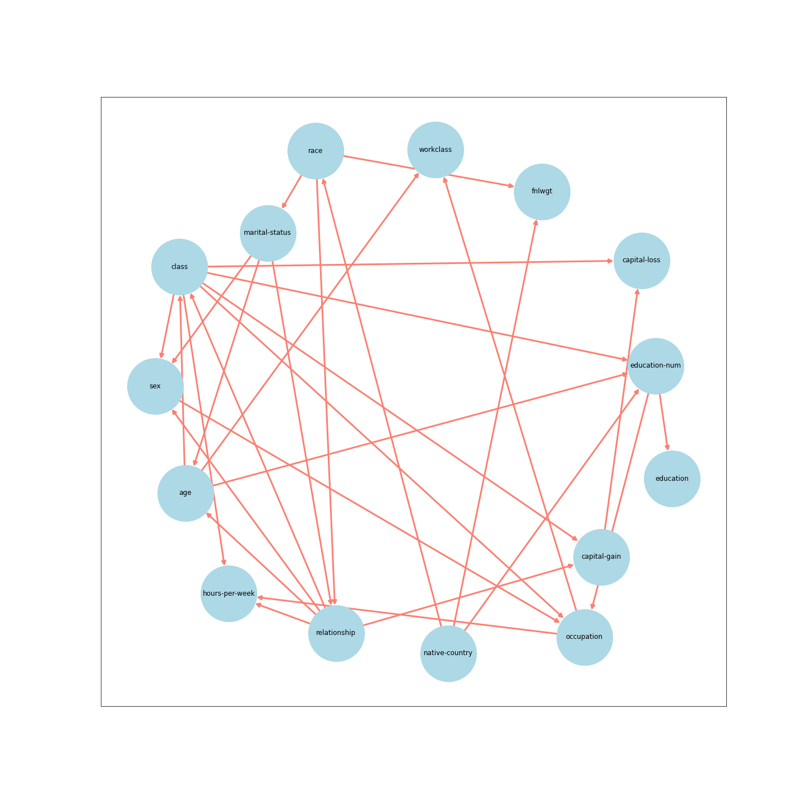

# learn-bn-struct-pars

This project is about learning a Bayesian Network (BN) structure from an existing dataset using the [`pgmpy`](https://github.com/pgmpy/pgmpy) package, visualizing its structure, running inference and performing analysis.

## The dataset

The **adult** dataset can be found at [OpenML](https://www.openml.org/d/1590), but appeared originally at the [UCI](https://archive.ics.uci.edu/ml/datasets/Adult)'s database. 
It refers to a classification task, namely which people earn fifty thousand dollars ($50k) (or more) a year. Variables are all self-explanatory except `fnlwgt`; as definded by the source: 
> This is a proxy for the demographic background of the people: _People with similar demographic characteristics should have similar weights_.

There is a total of 15 features: `class` (target), `age`, `workclass`, `fnlwgt`, `education`, `education-num`, `marital-status`, `occupation`, `relationship`, `race`, `sex`, `capital-gain`, `capital-loss`, `hours-per-week` and `native-country`.

### Preprocessing

Although not neccesary for BNs, in this case, missing values have been imputed (filled) and continuous variables have been discretized.
It mainly has to do with `pgmpy`'s lack of support for those features.

## Learning process

It can be divided into structure learning and parameter learning.

- Learning the **structure** of a BN means deciding what edges exist between the nodes and their direction (parent-child relationship). A BN must be represented by a directed acyclic graph (DAG).
- Learning the **parameters** of a BN entails estimating what are the probabilites of the nodes. More precisely, the joint distribution over the variables of a BN is defined as the product of conditional probability distributions (CPDs).

The final model can be represented by the following BN:

## Inference

Once the BN is defined (DAG and CPDs), one can make further inquiries about the rest of the probabilities contained in the network, be those joint or conditioned. This is known as inference.